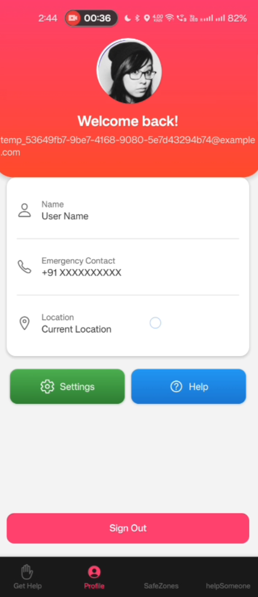
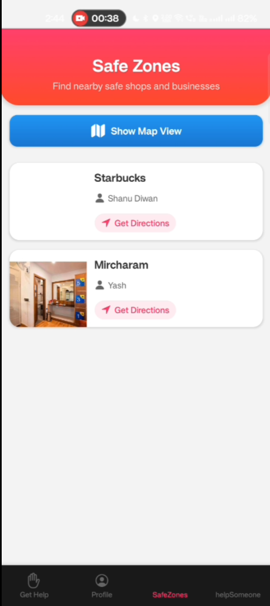
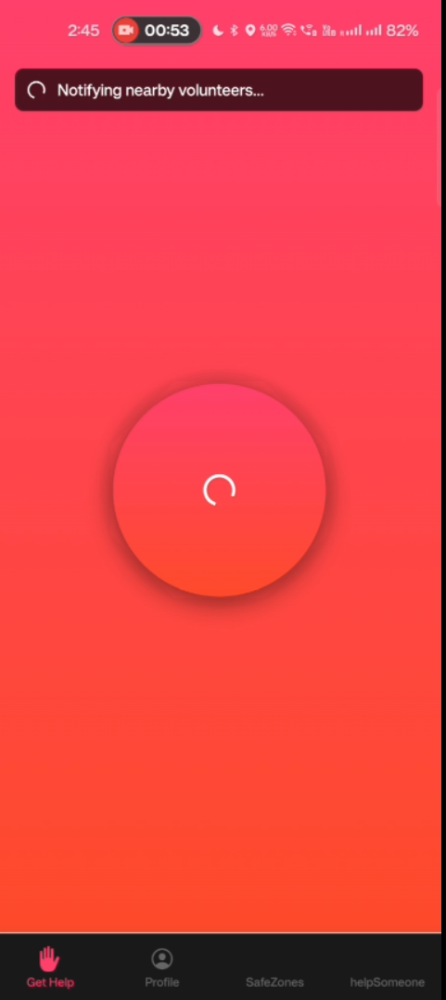
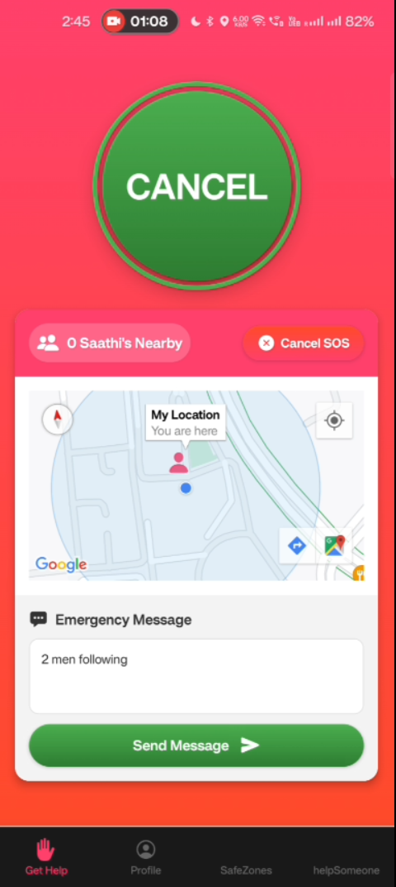

# Aarya - Women Safety App

##  Problem Statement

Women's safety remains a critical concern in today's society, with many facing harassment, violence, and unsafe situations in their daily lives. The lack of immediate assistance and reliable verification mechanisms often exacerbates these situations. Current safety solutions often lack real-time response capabilities, secure identity verification, and seamless integration with emergency services.

##  Our Solution

Aarya is a comprehensive women's safety mobile application that provides:

- **Real-time Emergency Alerts**: Instant notification to trusted contacts with live location sharing
- **Aadhaar Verification**: Secure identity verification using government-issued Aadhaar cards
- **Face Matching**: Biometric verification to ensure the person matches their ID
- **Quick SOS Trigger**: One-tap emergency button for immediate assistance
- **Live Location Tracking**: Continuous location sharing with trusted contacts during emergencies
- **Safe Route Planning**: AI-powered route suggestions based on safety parameters

##  Working Demo Video (Aarya)

<div align="center">
  <video src="https://github.com/dhruvbhadhotiya/shescape-triwizard/assets/Aarya.mp4" width="800" controls>
    Your browser does not support the video tag.
  </video>
</div>

 *Click the play button above to watch the demo*

##  Screenshots

| | |
|:-------------------------:|:-------------------------:|
|  |  |
| **Screenshot 1** | **Screenshot 2** |
|  |  |
| **Screenshot 3** | **Screenshot 4** |

##  Explanation Video

<div align="center">
  <h3>Watch our detailed demo and explanation</h3>
  <a href="https://youtu.be/OjlOkJb56Bk?si=CmYsVt5MLF9O6VDT" target="_blank">
    
  </a>
  <p>Click the image above to watch the full video on YouTube</p>
</div>

##  How to Run the Project

### Prerequisites
- Node.js (v16 or higher)
- npm or yarn
- Expo CLI (`npm install -g expo-cli`)
- Android Studio / Xcode (for mobile development)
- Supabase account (for backend services)

### Installation

1. **Clone the repository**
   ```bash
   git clone https://github.com/yourusername/shescape-triwizard.git
   cd aarya-safety-app
   ```

2. **Install dependencies**
   ```bash
   npm install
   cd server
   npm install
   cd ..
   ```

3. **Set up environment variables**
   Create a `.env` file in the root directory with the following variables:
   ```
   SUPABASE_URL=your_supabase_url
   SUPABASE_ANON_KEY=your_supabase_anon_key
   GOOGLE_CLOUD_VISION_API_KEY=your_google_vision_api_key
   ```

4. **Start the development server**
   ```bash
   # Start the Expo development server
   npm start
   
   # In a new terminal, start the backend server
   cd server
   npm run server:dev
   ```

5. **Run on your device**
   - Scan the QR code with the Expo Go app (iOS) or Camera app (Android)
   - Or run on an emulator using:
     ```bash
     # For Android
     npm run android
     
     # For iOS
     npm run ios
     ```

##  Contributing

We welcome contributions!.

##  Acknowledgments

- Thanks to all the open-source projects that made Aarya possible
- Special thanks to our mentors and the developer community for their support
